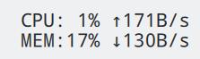
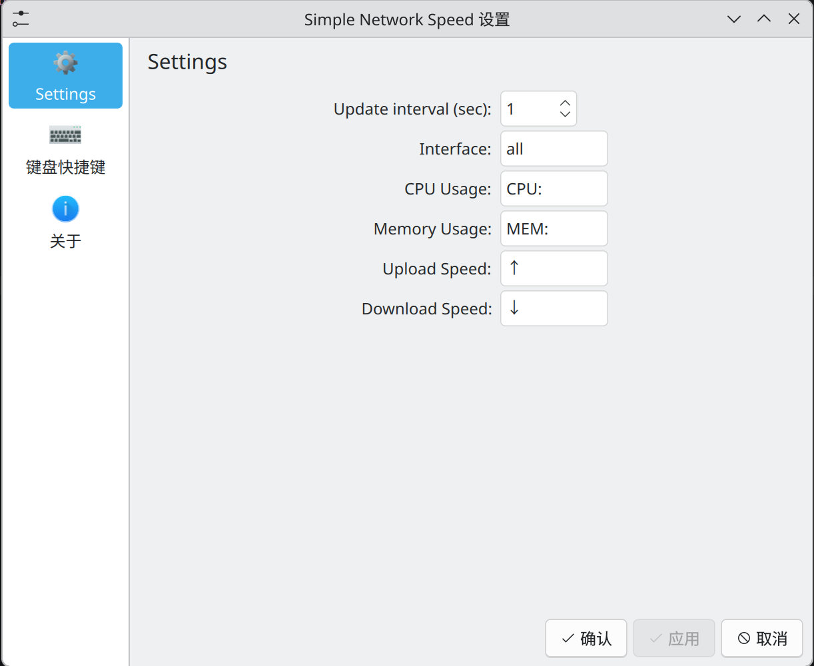

# Simple Network Speed

[](https://opensource.org/licenses/MIT)

Simple Plasma 6 widget shows network download and upload speed

<p align="center">
  
</p>
<p align="center">
  
</p>

## Install

```
cd ~/.local/share/plasma/plasmoids
git clone https://github.com/q77190858/org.kde.simple.network.speed
```
